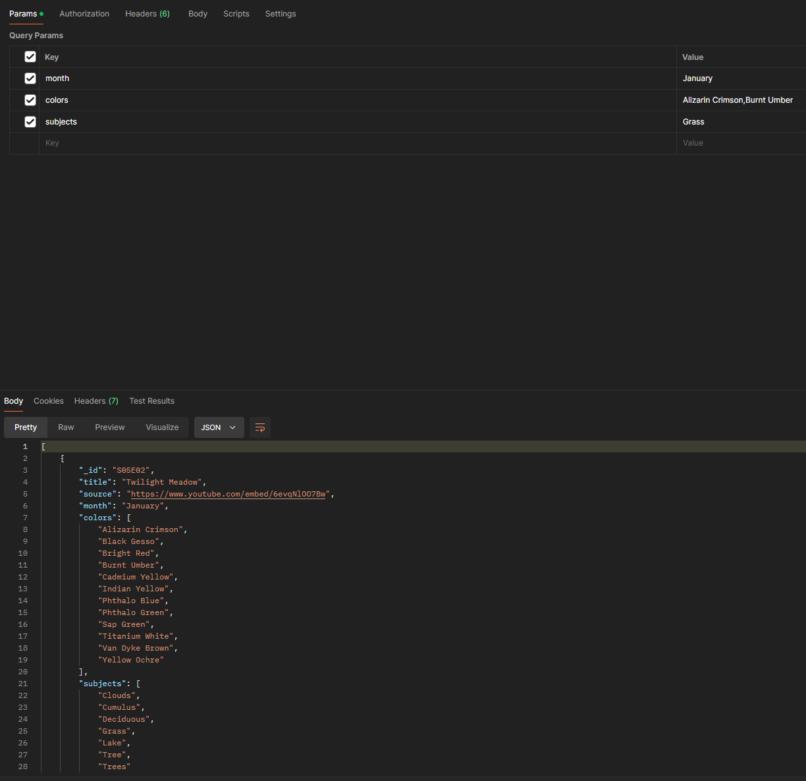

# The Joy of Painting API
This project was the result of learning the basics of the ETL process. I took two csv files and one txt file containing information on all 403 Bob Ross Episodes.
In the etl/ directory, you can find my extraction, transformation, and loading scripts. To access the API, follow the instructions listed below. Episodes can be filtered via month published, colors present in the episode, and subjects painted in the episode.

## Table of Contents
* [Infrastructure](#Infrastructure)
* [Example](#Example)
* [Instructions](#Instructions)
* [Retrospective/Stretch-Goals](#Retrospective/Stretch-Goals)
* [Authors](#authors)

## Infrastructure
This project was created using JavaScript/NodeJS (Version 20.11.1), with database access utilizing Mongoose. Additionally, csv-parse and fs/promises were used for parsing csv data
and managing files.

## Example


## Instructions
To set up the API, clone the repo with:
```
git clone https://github.com/Jtownokie/atlas-the-joy-of-painting-api.git
```
Then run the etl scripts with:
```
node extract.js
node transform.js
node load.js
```
Making sure to replace the database credentials with your own database info.
Finally, to enable the API endpoints, run:
```
npm run dev
```

## Retrospective/Stretch-Goals
This was my first experience working with the ETL process. I developed a myriad of practical skills for utilizing regex, and transforming data.

Additional goals for this project are to:
* Implement more nuanced filtering options by converting months, colors, and subjects into their own objects.
* Integrate GraphQL into the API

## Authors
Christopher Stephens - [Github](https://github.com/Jtownokie) <br/>
